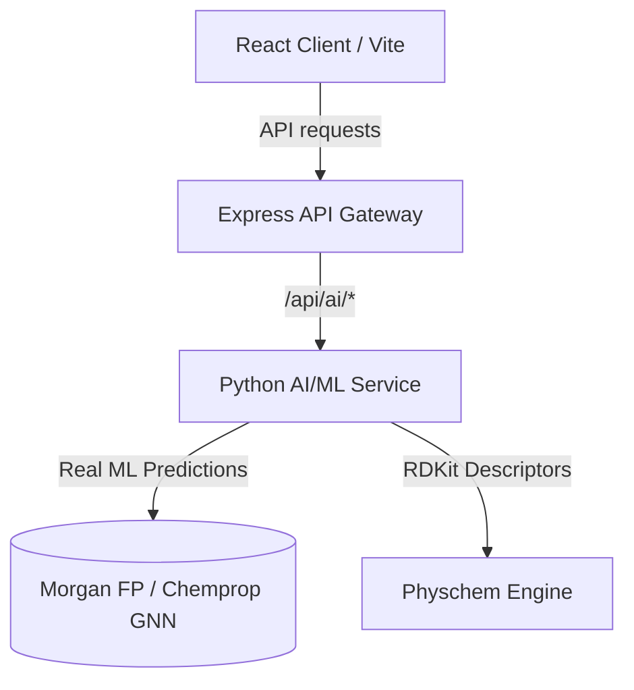

# Hakase BioTwin Preclinical Digital Twin Platform

Hakase BioTwin is a state-of-the-art, full-stack preclinical digital twin simulation platform. It integrates advanced physical chemistry analysis, structural mutagenicity scans, 3D molecule structural visualization, in silico/ex vivo safety assays, and high-fidelity Machine Learning model predictions (Graph Neural Networks and Random Forests) to profile drug candidates and evaluate regulatory IND readiness.

---

## 🏗️ Platform Architecture

The system is organized as a multi-tier microservice architecture:



### 1. **Frontend: React Application (`/artifacts/hakase-ai`)**
*   Built with React, Vite, TypeScript, and Framer Motion.
*   Uses a dark-mode glassmorphic design system for a premium scientific look.
*   Integrates `3dmol` for real-time 3D structural protein-ligand viewer interaction.
*   Communicates with the API gateway using relative endpoints (e.g. `/api/ai/*`), fully proxied in development mode.

### 2. **API Middleware: Express Gateway (`/artifacts/api-server`)**
*   Built with Express and TypeScript.
*   Handles request validation, database interactions (Drizzle ORM + SQLite), and therapeutic area modifiers.
*   Reverse proxies `/api/ai/*` to the downstream Python machine learning service.

### 3. **AI/ML Engine: Python Service (`/artifacts/ai-service`)**
*   Powered by Flask, RDKit, SciPy, and Scikit-Learn.
*   Performs structural pharmacophore scans (Ames mutagens, DILI risks, hERG block indicators).
*   Consists of three primary production-ready machine learning engines:
    *   **DILI-ML:** A Random Forest classifier trained on the FDA DILIrank dataset ($n=475$ compounds) utilizing Morgan fingerprints and RDKit descriptors.
    *   **CardioTox ML (DeepHIT):** A Random Forest model trained on ChEMBL ($n=655$ assays) to predict hERG channel blocking probabilities.
    *   **ADMET-AI:** A pre-trained deep Graph Neural Network (**Chemprop GNN ensemble**) predicting 41 endpoints directly from molecular structure.

---

## 🛠️ Developer Guide & Startup Instructions

Follow these instructions to start the full-stack suite locally.

### 1. **Prerequisites**
Ensure you have the following installed on your machine:
*   **Node.js** (v20 or higher)
*   **pnpm** (Required package manager, do not use `npm` or `yarn`)
*   **Python** (v3.11 or higher)
*   **Git** & **Git LFS** (required for model weight storage)

---

### 2. **Installation**

#### Step A: Install JS Dependencies
From the repository root, install the pnpm workspace dependencies:
```bash
pnpm install
```

#### Step B: Install Python Dependencies & Model Warmup
Create a virtual environment, activate it, and install dependencies from the workspace root:
```bash
python -m venv .venv
source .venv/bin/activate
pip install -r pyproject.toml
```

If your NumPy/RDKit versions complain, ensure they are pinned correctly (NumPy 2.x and RDKit 2026.x compatible packages are fully supported).

---

### 3. **Starting the Services (Local Dev)**

You need to run **three services** concurrently in separate terminal windows. Make sure your Python virtual environment is active in the backend terminal.

#### 🖲️ Terminal 1: Python AI/ML Service
Navigate to the AI service folder and start the Flask server:
```bash
cd artifacts/ai-service
python main.py
```
*   **URL:** `http://localhost:5000`
*   *Note: If port 5000 is occupied (e.g. by macOS AirPlay Receiver), configure the server or disable the receiver in macOS System Settings.*

#### 🛡️ Terminal 2: Express API Middleware
From the root of the repository, launch the Node Express API server:
```bash
PORT=3000 DATABASE_URL="file:local.db" pnpm --filter @workspace/api-server dev
```
*   **URL:** `http://localhost:3000`
*   Acts as the central API gateway and serves SQLite database operations.

#### 🎨 Terminal 3: Vite React Frontend
From the root of the repository, start the Vite client dev server:
```bash
PORT=5173 BASE_PATH="/" pnpm --filter @workspace/hakase-ai dev
```
*   **URL:** `http://localhost:5173`
*   In development mode, Vite configuration proxies all `/api` requests automatically to the middleware on `http://localhost:3000` to prevent CORS issues.

---

## 🧪 Verification & Health Check

Once all services are running, verify communication via these health check curls:

1.  **AI/ML Service Health check:**
    ```bash
    curl -s http://localhost:5000/health
    # Expect: {"status":"ok","service":"HakaseAI AI Service","version":"1.0.0"}
    ```
2.  **API Server Proxy Health check:**
    ```bash
    curl -s http://localhost:5173/api/ai/health
    # Expect: {"status":"ok","service":"HakaseAI AI Service","version":"1.0.0"}
    ```

If both verify successfully, open your browser to `http://localhost:5173/dashboard` and you are ready to simulate preclinical twins!
